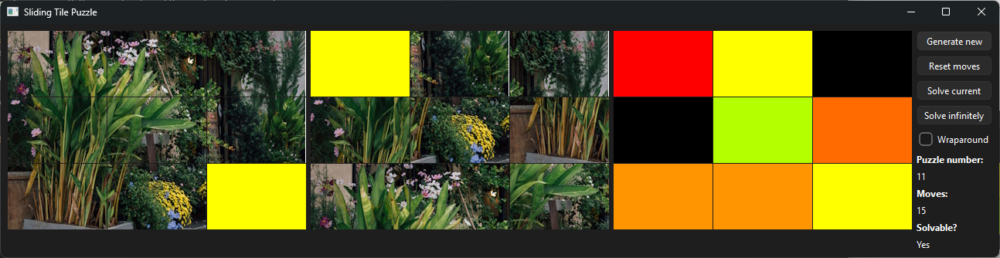

# Sliding Tile Puzzle Application

An application having a PyQt based graphical user interface (GUI) to generate sliding tile puzzles to be solved either manually or automatically.

## Installation

Since the wheel file is hosted at TestPyPI for the time being and dependencies are outdated (at TestPyPI), first install without installing dependencies (**--no-deps**)

> python -m pip install **--no-deps** -i https://test.pypi.org/simple/ sliding-tile-puzzle-app-amfd

and then install the dependencies from the default package index (PyPI) using the requirements.txt file

> python -m pip install -r requirements.txt

## Usage

To run the application

> python -m sliding_tile_puzzle_app_amfd.run

or in a script

> import sys
> 
> from sliding_tile_puzzle_app_amfd import SlidingTilePuzzleApp
>
> if \_\_name__ == '\_\_main__':
> 
>     app = SlidingTilePuzzleApp(sys.argv) # or an empty list instead of sys.argv
>
>     sys.exit(app.exec())

The application shows three sets of tiles to the user: the solution of the puzzle, the puzzle being solved (current positions of the puzzle tiles) and a heatmap displaying how fair the tiles of the puzzle being solved are from their final positions (red for maximum possible distance/diagonal distance, yellow for half the diagonal distance, green for zero distance, along with all intermediate colors between red and yellow and between yellow and green, and black for tiles at their final positions).

Use the keyboard arrow keys to manually solve the current puzzle. Ticking the "Wraparound" checkbox allows solving the puzzle in a revolving fashion: if the missing tile is in the last/first row (column) and is moved down/up (right/left), it will end up in the first/last row (column), as if the first and last rows and first and last columns were adjacent to each other.

A new puzzle (same image, different initial tile positions) can be generated by clicking the "Generate new" button. All the moves so far (from the initial tile positions of the current puzzle) can be reset by clicking the "Reset moves" button.

The current puzzle can be solved by click the "Solve current" button. Clicking the "Solve infinitely" button will solve the current puzzle and keep solving new puzzles *ad infinitum*, equivalent to pressing the "Generate new" after a puzzle had been solved by clicking the "Solve current" button indefinitely. Automatic puzzle solving can be stopped by clicking the button that initiated it (when solving a single puzzle, only while the puzzle has not been completely solved it is possible to stop automatic solving).

